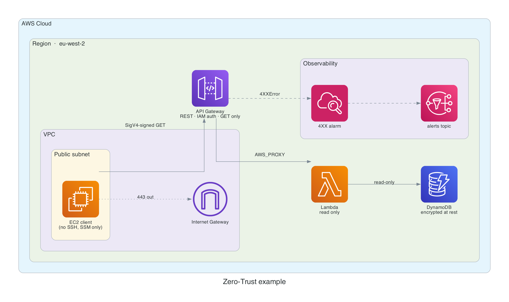

# Zero-Trust Inventory API

## System overview

## TLDR

I read about zero trust, loved it, and this is my attempt at building one with IAC on AWS

## What is zero trust?

Zero trust is a security model. In this model, the source of the traffic does not give trust so each component must show its identity. Each component must have an explicit permission. The network gives a connection. IAM gives the trust.

## IAM authorization (SigV4), not API keys, not an open endpoint

The client signs each request then the signature uses temporary credentials from the instance role. API Gateway examines the signature. IAM then examines the permission `execute-api:Invoke` for the caller.

Do not use an API key for authentication. An API key is a static shared secret and each person with the key becomes the client. AWS made API keys for usage plans and throttling only.

Do not use an open endpoint with network controls. A source IP address shows a location an identity so if an attacker controls a host in the trusted range, the attacker gets full access. SigV4 credentials change automatically after some hours and each credential connects to one IAM principal with CloudTrail recording each use.

## The client role has permission for GET only

The instance role policy gives `execute-api:Invoke` for `*/GET/*` on this one API. IAM refuses a signed POST request. This is least privilege at the HTTP method level. The client reads the inventory. Thus the client has read permissions only.

The API has one GET method and no other methods. Two independent layers give the same result. If one layer has an error, the other layer continues to operate.

## A resource policy for one role only

IAM authorization alone is not sufficient, because it accepts each principal in the account with a correct identity policy. The resource policy stops this. The policy has an Allow statement for the client role and a Deny statement for all other principals, and the Deny statement uses the condition key `aws:PrincipalArn`.

For an assumed-role session, `aws:PrincipalArn` contains the role ARN, so each session of the client role gets access. All other identities do not get access, and this includes an administrator in the console. In IAM evaluation, a Deny statement always defeats an Allow statement.

Limitation: you cannot test the endpoint from the console, so test from the instance. This test is the same as real traffic.

## SSM Session Manager, not SSH

The security group has no ingress rules, and the instance has no key pair. These are two independent controls against SSH: there is no open port, and there is no credential.

The SSM agent opens an outbound HTTPS connection to the Session Manager service, and your shell session moves through this connection. The instance does not listen for inbound connections. You also get:

- Access control with IAM: the permission `ssm:StartSession` controls the access, not key files
- A CloudTrail record for each session start
- Optional session logs in S3 or CloudWatch
  Do not use a bastion host. A bastion host is a second machine, so you must patch it, monitor it, and expose it. SSM removes the inbound path fully.

## The Lambda execution role has four read actions

The policy gives `GetItem`, `BatchGetItem`, `Query`, and `Scan` for the table ARN and its indexes. The policy has no write actions, no wildcard actions, and no wildcard resources.

If an attacker controls the function, the damage is small, because the attacker reads one table only. The attacker cannot write data, cannot delete data, and cannot get access to other tables. IAM examines the role, not the code.

The log permissions apply to the log group of this function only. The managed policy `AWSLambdaBasicExecutionRole` uses a wildcard for the full account, so do not use it.

## The AWS managed KMS key (aws/dynamodb)

The configuration `server_side_encryption { enabled = true }` with no `kms_key_arn` selects the AWS managed key. There are three options:

- AWS owned key (the default if the block is not present). The key is free, but the key is in a shared AWS pool, so CloudTrail does not record the key usage in your account and you cannot examine the key policy.
- AWS managed key (the selected option). The key is free and the key is in your account, so CloudTrail records each decrypt operation. AWS rotates the key and controls the key policy.
- Customer managed key. You control the key policy, the grants, and the rotation, but the cost is 1 USD each month plus API charges. Select this option if compliance requires key-level access control or cross-account access.
  For this system, the audit trail is important and a custom key policy is not important, so the AWS managed key is the correct option. It has a lower cost and less complexity.

## IMDSv2 is mandatory

The configuration `http_tokens = "required"` makes a session token mandatory for metadata requests. IMDSv1 gave an answer to a simple GET request, so an SSRF (Server-Side Request Forgery) defect in an application could send the role credentials to an attacker. IMDSv2 requires a PUT request first to get a token, and a standard SSRF attack cannot do a PUT request. The hop limit of 1 stops containers, so a container cannot get access to the metadata endpoint through the host.

## Egress on port 443 only

The client security group permits outbound TCP 443 only. This one rule is sufficient for SSM registration, package installation, and the API Gateway request, and all other outbound protocols fail. If an attacker controls the instance, this rule limits data theft and movement to other systems.

## An alarm on 4XX errors, with SNS notification

Each refused request gets a 4XX response, for example a request with no signature, a request from a different principal, or a request with a different HTTP method. API Gateway counts these responses in the `4XXError` metric for each API and stage. The alarm operates at five or more errors in five minutes, then sends a message to an SNS topic. An email subscription is optional, and a variable controls it.

Monitor 4XX before 5XX, because in a zero-trust design a refused request is the security signal. A 4XX increase shows an attack test, incorrect credential use, or a defective client, and each cause requires a person. The configuration `treat_missing_data = notBreaching` keeps the alarm in the OK state when there is no traffic.

## Remote state in S3 with lockfile locking

The state is in an S3 bucket, and the bucket has versioning and encryption. The configuration `use_lockfile = true` (Terraform 1.10 or higher) writes a `.tflock` object for each state write, and the write is a conditional PutObject. If two applies operate at the same time, one apply gets the lock and the other apply fails immediately.

Do not use the DynamoDB lock table. The lockfile method removes one resource, its IAM permissions, and its cost. HashiCorp deprecated the DynamoDB method after S3 got conditional writes, so one bucket now gives storage, history, and locking.

The bucket is not in the Terraform configuration because a backend cannot manage the bucket for its own state.

## Seed data through the data plane, and cursor pagination

The configuration has no `aws_dynamodb_table_item` resources, so the Terraform state contains infrastructure only. The script `scripts/seed.sh` writes the rows with `batch-write-item` after apply. Row data in a state file is a data leak into the control plane, and it also connects the data lifecycle to `terraform destroy`.

## Ideas for a production system

- Add VPC interface endpoints for SSM and execute-api. Then the traffic does not go through the internet gateway.
- Move the client to a private subnet after the endpoints exist. Remove the public IP.
- Add access logs to the API Gateway stage, together with the 4XX alarm.
- Add deletion protection and `prevent_destroy` to the table when real data is in it.
- Add a customer managed KMS key if compliance requires key policy control.
